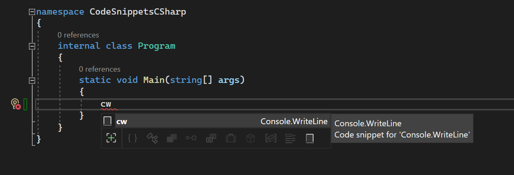
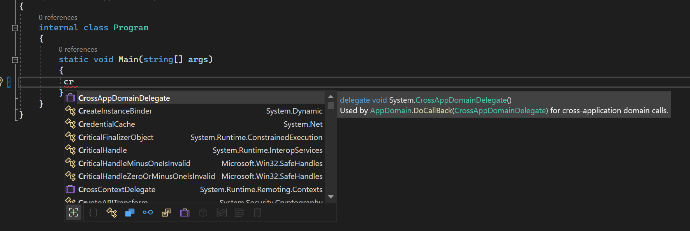
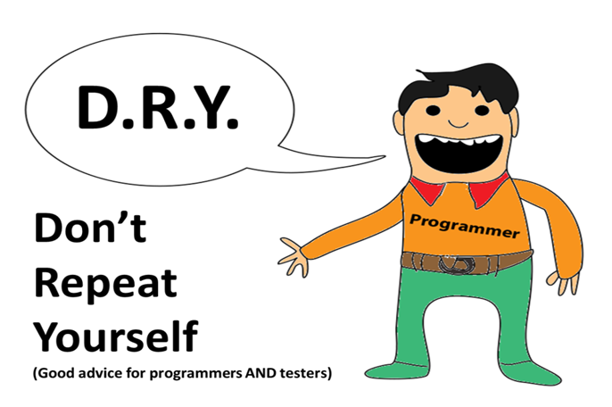

# CodeSnippetsCSharp

Typing "cw" in your Visual Studio IDE pops out a code snippet for Console.WriteLine():

But how about Console.ReadLine()?

Nothing. Then you have to type the whole line Console.ReadLine().

Having code snippets greatly saves you time and helps reduce all those repetitive coding and typing. Just like the pattern "DRY", which means "Do Not Repeat Yourself", having code snippets on standby and readily available as a shortcut inside your Visual Studio IDE, is better than looking up codes again and again from external sources.

This repo is where I consolidate my commonly used repetitive Code Snippets which greatly saves time and helps you focus more on your algorithm than typing.

